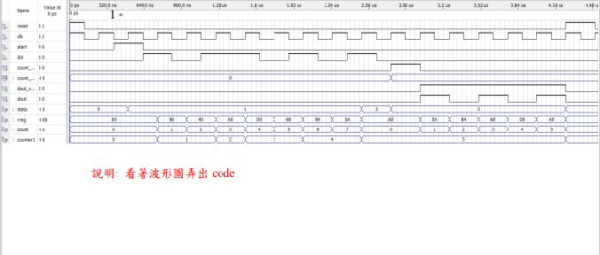
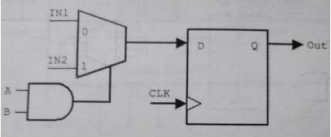
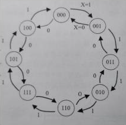
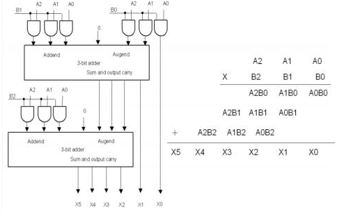
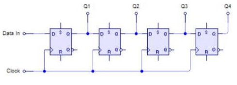
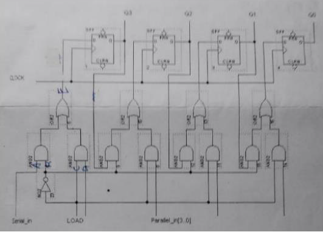
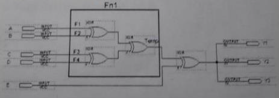

# Digital-Systems

## HW1
主要透過VHDL撰寫來實作4-bits 加減法器

 

## HW2
主要透過VHDL實作一個序向電路  
功能如下:
- 重置信號 reset 信號非同步，當輸入信號 reset 為 1，將電路內部所有正反器清除為 0。

- 當偵測到輸入信號 start 為 1 時，其後連續 8 個 clk 週期，將有連續 8 個位元的資料由輸入信號 din 以 serial 方式輸入；電路開始接收 8 個位元資料輸入時，開始計算其中有多少個 1。當接收到第 8 個位元資料輸入之後，集產生一個為 1 之輸出信號 cout_out，波形寬度為 1 clk，並同時將計算結果輸出至 cout_one。

- 在送出計算結果之後的連續 8 個週期，將 8 個位元的輸入資料，以反順序由輸出信號 dout 送出，同時在這 8 個週期期間將輸出信號 dout_valid 設定為 1。

 

## HW3
主要核心概念在於透過多工器及DEF來實作以下電路  

 

## HW4
主要以VHDL來實作前瞻進位加法器

 

## HW5
主要透過VHDL對以下的Moore狀態機計數進行實作

 

## HW6
從電路圖來說,主要是以加法器搭配AND Gate來實作出乘法器,但缺點是發生overflow會有資料遺失(例如:111+111)

 

## HW7
以For-Generate實現電路,其特色是串列輸入且並列輸出(SIPO)

 

## HW8
以Component和Port map來實現電路,其特色是移位暫存(PISO; 並列輸入且串列輸出)

 

## HW9
本作業主要透過撰寫function call之VHDL語法來實現以下電路

 

## KSA_HW
本作業是透過VHDL語法來實作Kogge-Stone Adder

