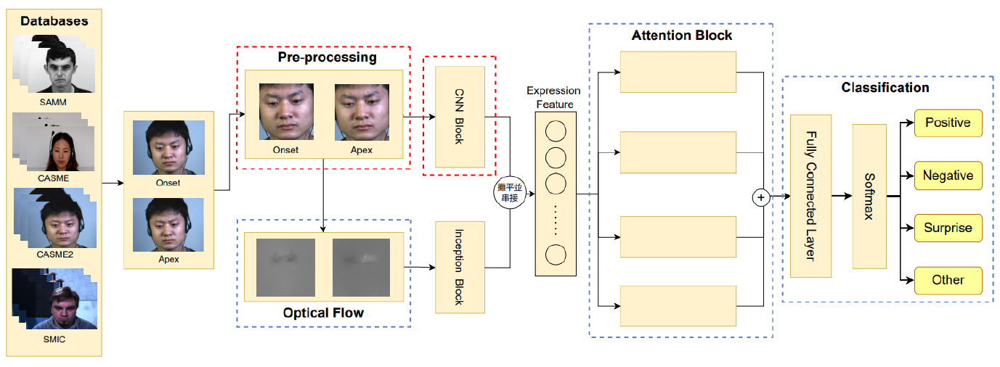
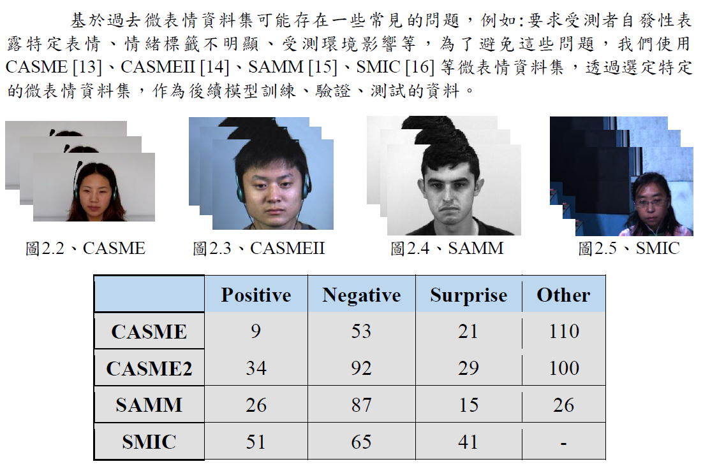
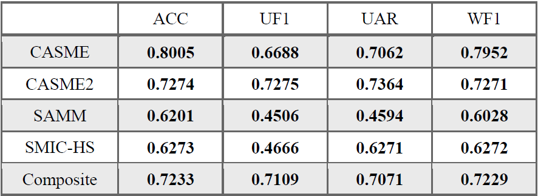
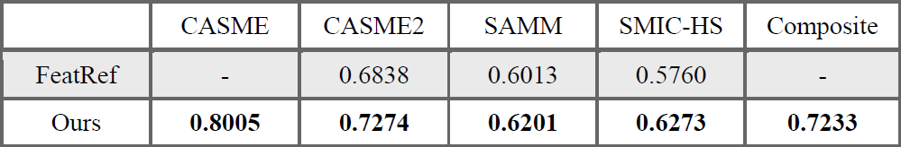
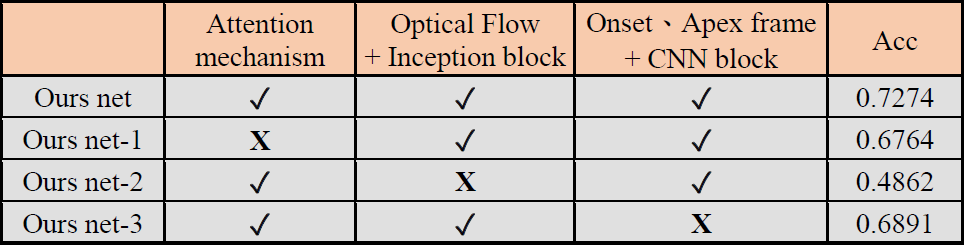

# Senior Project
## Model Architecture
本組專題架構圖如下, 從Feature refinement: An expression-specific feature learning and fusion method for micro-expression recognition論文改良而來

 

## Database
資料集的取得均有簽署相關合約取得授權! 資料集相關說明如下圖:

 

## Performance
在驗證階段採用Leave-One-Subject-Out, 並且我們針對4個獨立資料集(CASME、CASME2、SAMM、SMIC-HS)及綜合資料集(前述四個資料集混合)進行訓練，可得到它們相對應的準確率、未加權F1分數、未加權平均召回率及加權的F1分數，透過這些常見的評估效能指標，我們將其用於評估我們改良的模型，結果如下:

 

## Compare
另外我們針對我們提出的方法和原始FR論文進行實驗對照組,我們改良的模型相對於FeatRef的結果在三個常見的資料集上 (CASME2、SAMM、SMIC-HS)準確率約提升2至5%左右，同時本組模型分別在CASME資料集和綜合資料集上分別取得80%及72%的準確率，訓練的超參數皆為50epoch及3round time的設定下進行訓練所得到的實驗結果!

 

## Ablation Study
我們透過CASME2微表情資料集進行消融研究來分析評估哪一個模組對於整體網路架構的影響力最大,其中最具影響力的是以動態訓練特徵為主Inception Block模組，其次是自我注意力機制 (Self-Attention mechanism)模組，最後是以靜態特徵訓練為主的CNN Block模組，將上述三個網路模組結合並訓練，可得到約72%左右的準確率!

 

## Conclusion
我們的模型架構是基於Feature Refinement原始論文，結合多種神經網路、光流法、attention機制，彌補FeatRef僅使用光流捕獲到微表情的動態資訊，卻忽略靜態資訊的問題，經本組改良後的model 在3個常見資料集(CASME2、SAMM、SMIC-HS) 上提升約2~5% 準確率、在綜合資料集取得72%準確率，證明了我們的模型有良好的泛化能力。
